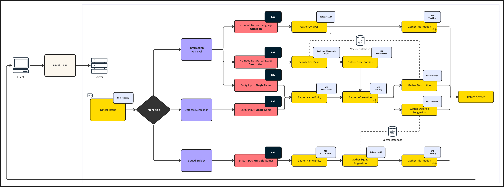
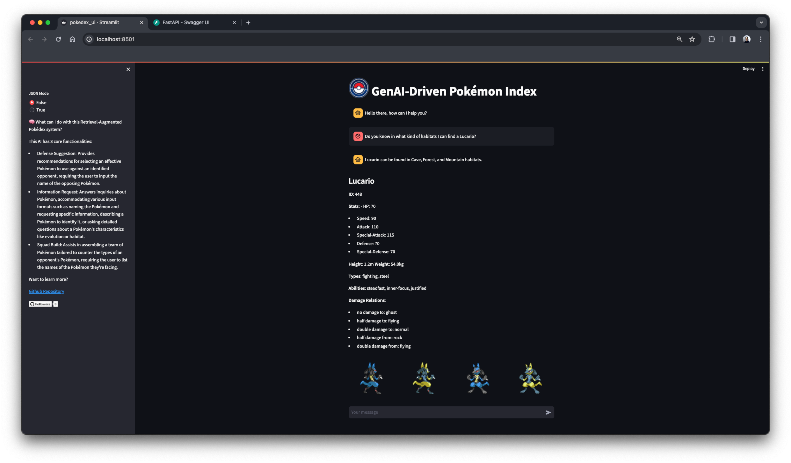

# RAG Architecture: GenAI Pokémon Go Strategy Assistant

## Overview


This projects is an end-to-end architecture designed to enhance [Pokémon Go](https://pokemongolive.com/?hl=en) UX. Here 
demonstrates a sequential process involving multiple Large Language Model (LLM) 
`gpt-4` agents, leveraging a [Retrieval-Augmented Generation (RAG)](https://research.ibm.com/blog/retrieval-augmented-generation-RAG) system to deliver 
personalized responses.

<p align="center">
 
</p>


## Features
- **End-to-End Architecture**: Integration of multiple LLM agents using a 
  sequence-by-sequence process.
- **Personalized Responses**: Utilization of a Retrieval-Augmented Generation (RAG) 
  system to tailor interactions.
- **Pokémon-Focused Application**: Designed as a complementary strategy assitant for 
  Pokémon users.


## Tech Stack

- **Python 3.10**: The backbone of our project, ensuring a modern and efficient 
  development environment.
- **FastAPI**: A modern, fast (high-performance), web framework for building APIs 
  with Python 3.7+ based on standard Python type hints.
- **Faiss Vector Database**: Utilization [Meta's High-Performance Vector Database](https://engineering.fb.com/2017/03/29/data-infrastructure/faiss-a-library-for-efficient-similarity-search/) to 
  optimize memory usage and speed, with excellent GPU architecture adaptability.
- **Streamlit Application**: A user-friendly interface to interact with the system 
  by a QA-chatbot.
- **Langchain Library**: A library to facilitate the communication between the 
  GPT-4 and the LLM Agents.
- **OpenAI API**: Integration with the OpenAI API to leverage the GPT-4 model.
- **Pokepy**: A Python wrapper for the Pokémon API, providing a simple way to access 
  Pokémon data through Pydantic model input schemas.


## Architecture

For an in-depth understanding of the architecture and to access the full article, 
please visit my [website](https://www.robguilar.com/posts/genai_pokemon_strategy_assitant).


  


## Getting Started

To delve into the architecture and explore the application, please ensure you have 
`Python 3.10` installed, along with the Langchain library and Faiss by Meta.

Important notes:

**System** - The entire setup process is designed for Unix-based systems, so you can 
use the next Makefile commands to run locally your system, otherwise, you can 
replicate the commands of the Makefile in your terminal.

**Environment Variables** - each one of the next commands will `source` the variables 
defined in you `.env` file, so double check that your OpenAI API Key is in place. If 
you want to make permanent changes, you would need to add these variables to your 
shell initialization script (like `.bashrc`, `.bash_profile`, or `.zshrc` for 
Unix/Linux/MacOS, or Environment Variables on Windows).


### Create a Virtual Environment

Create a virtual environment using the following command:

```bash
make create_venv
```


### Activate the Virtual Environment

Activate the virtual environment using the following command:

```bash
source .venv/bin/activate
```

### Install the Dependencies

Install the dependencies using the following command:

```bash
make install_dev
```

### Install the Test Dependencies

Install the test dependencies using the following command:

```bash
make install_test
```

### Run API Server

Run the API server using the following command:

```bash
make api_server
```

Display the Swagger UI documentation to see the available endpoints at: 
[http://localhost:8000/docs](http://localhost:8000/docs)

### Display UI

Run the Streamlit app using the following command:

```bash
make display
```


## Usage examples

The following are examples of the different types of interactions that the system 
can handle, which are categorized by the intent type and the structure type.

### Intent Types

`defense_suggestion`: An unknown Pokémon has appeared and the user needs a 
suggestion to use a Pokémon against it. The user must provide the name of the 
Pokémon as part of the input.

`information_request`: The user wants to know more about a Pokémon. In the input, 
the user must provide one of the following input text structures: (1) the name of 
the Pokémon with a request for information, (2) a description of a Pokémon in 
natural language without explicitly mentioning the name of the Pokémon with the 
intention of guessing what the Pokémon is, OR (3) a question about the Pokémon with 
the Pokémon name explicitly mentioned, asking for a specific attribute such as: 
Evolution, Diet, Habitat, Base Stats, etc.

`squad_build`: The user wants to build a squad of Pokémon based on the opponent's 
Pokémon types. The user must provide a list of Pokémon names as part of the input.

`None`: Return GPT-4 own response. The user request does not fall into any of the 
above categories.

**Prompt examples**:

| Intent Type         | Structure Type                 | Example                                                                                                                                            |
||--|-|
| defense_suggestion  | `any`                          | I stumbled upon a wild Grovyle lounging in the park! Which Pokemon should I choose for an epic battle to defeat it?                                |
| information_request | `pokemon_names`                | Alright, Pokédex! It's time to find out everything about Snorlax and Pikachu!                                                                      |
| information_request | `natural_language_question`    | Do you know in what kind of habitats I can find a Psyduck?                                                                                         |
| information_request | `natural_language_description` | Can you guess which Pokémon is a dual-type Grass/Poison Pokémon known for the plant bulb on its back, which grows into a large plant as it evolves |
| squad_build         | `any`                          | Time to challenge the Fire Gym Leader! He's got a tough team with a Ninetales and Combusken, but I need your help to build a squad                 |
| None                | `any`                          | I love Pretzels                                                                                                                                    |


**Response examples**:

Prompt: _Do you know in what kind of habitats I can find a Lucario?_




Answer with `JSON mode` enabled:

```json
{
  "header": "Lucario can be found in Cave, Forest, and Mountain habitats.\n",
  "body": [
    " ### Lucario\n\n**ID**: 448\n\n**Stats**: - HP: 70\n - Speed: 90\n - Attack: 110\n - Special-Attack: 115\n - Defense: 70\n - Special-Defense: 70\n\n**Height**: 1.2m  **Weight**: 54.0kg\n\n**Types**: fighting, steel\n\n**Abilities**: steadfast, inner-focus, justified\n\n**Damage Relations**:\n - no damage to: ghost\n- half damage to: flying\n- double damage to: normal\n- half damage from: rock\n- double damage from: flying\n"
  ],
  "sprites": {
    "Lucario": [
      "https://raw.githubusercontent.com/PokeAPI/sprites/master/sprites/pokemon/back/448.png",
      "https://raw.githubusercontent.com/PokeAPI/sprites/master/sprites/pokemon/back/shiny/448.png",
      "https://raw.githubusercontent.com/PokeAPI/sprites/master/sprites/pokemon/448.png",
      "https://raw.githubusercontent.com/PokeAPI/sprites/master/sprites/pokemon/shiny/448.png"
    ]
  },
  "intent_type": "information_request",
  "intent_structure": "natural_language_question"
}
```

